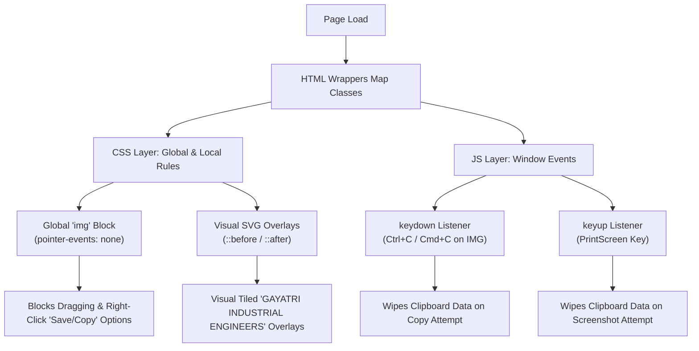

# Gayatri Industrial Engineers 2.0 — Copyright & Watermark Protection System Analysis

This document provides a complete technical analysis and documentation of the copyright and watermark protection system implemented across the Gayatri Industrial Engineers website. 

> [!IMPORTANT]
> This is a **read-only** analysis. No modifications have been made to the codebase. The files listed below have been inspected to understand the existing logic.

---

## 1. Architecture Overview

The copyright and image protection system operates as a **tri-layered defense mechanism** combining HTML structural containers, CSS presentation/interaction blocking, and JavaScript clipboard manipulation.



### Protection Workflow:
1. **Initial Rendering (CSS)**: When a page loads, the global styling disables user interaction (dragging, selecting, and clicking) on all `` elements. Simultaneously, containers with watermark-associated classes render a visual tiled SVG watermark on top of the images.
2. **Mouse Interaction Prevention (CSS)**: By setting `pointer-events: none !important` on `` elements, any mouse hover, click, or right-click events pass right through the image to the wrapper. The browser's native context menu for images (which offers "Save image as..." or "Copy image") is bypassed since the browser does not recognize the click as targeting an image.
3. **Keyboard & OS Protection (JavaScript)**: If a user attempts to bypass the mouse restrictions (e.g., using inspector selections and copy shortcuts, or taking screenshots via the PrintScreen key), the JavaScript event handlers intercept the action and empty the system clipboard.

---

## 2. File Directory & Copyright System Involvement

Below is a breakdown of every file in the project and its relationship with the copyright/watermark system:

| File Name | Role in Copyright System | Key Details / Sections |
| :--- | :--- | :--- |
| [style.css](file:///c:/Users/Chandresh/Desktop/Work/Gayatri/Gayatri%20Industrial%20Engineers%202.0%20-%20Copy/style.css) | **Primary Core Control (CSS)** | Defines the visual SVG watermark background, handles image click/drag disabling, and layout rules. |
| [script.js](file:///c:/Users/Chandresh/Desktop/Work/Gayatri/Gayatri%20Industrial%20Engineers%202.0%20-%20Copy/script.js) | **Primary Core Control (JS)** | Installs global window key listeners to clear clipboard during copy and screenshot attempts. |
| [index.html](file:///c:/Users/Chandresh/Desktop/Work/Gayatri/Gayatri%20Industrial%20Engineers%202.0%20-%20Copy/index.html) | Watermarked Page | Applies `.product-img-placeholder` class on landing page product carousel wrappers. |
| [product-section.html](file:///c:/Users/Chandresh/Desktop/Work/Gayatri/Gayatri%20Industrial%20Engineers%202.0%20-%20Copy/product-section.html) | Watermarked Page | Applies `.gp-image-wrapper` class on product cards. |
| [blog.html](file:///c:/Users/Chandresh/Desktop/Work/Gayatri/Gayatri%20Industrial%20Engineers%202.0%20-%20Copy/blog.html) | Watermarked Page | Applies `.card-image`, `.modal-hero`, and `.watermarked-image` on blog cards, post detail views, and inline media. |
| [baby-felt-calander.html](file:///c:/Users/Chandresh/Desktop/Work/Gayatri/Gayatri%20Industrial%20Engineers%202.0%20-%20Copy/baby-felt-calander.html) | Watermarked Page | Applies `.diagram-card` on machinery diagrams and `.gallery-slide`/`.gie-lb-inner` on galleries. |
| [calander-machine.html](file:///c:/Users/Chandresh/Desktop/Work/Gayatri/Gayatri%20Industrial%20Engineers%202.0%20-%20Copy/calander-machine.html) | Watermarked Page | Applies `.diagram-card` on machinery diagrams and `.gallery-slide`/`.gie-lb-inner` on galleries. |
| [decatising-machine.html](file:///c:/Users/Chandresh/Desktop/Work/Gayatri/Gayatri%20Industrial%20Engineers%202.0%20-%20Copy/decatising-machine.html) | Watermarked Page | Applies `.diagram-card` on machinery diagrams and `.gallery-slide`/`.gie-lb-inner` on galleries. |
| [dyeing-jigger-machine.html](file:///c:/Users/Chandresh/Desktop/Work/Gayatri/Gayatri%20Industrial%20Engineers%202.0%20-%20Copy/dyeing-jigger-machine.html) | Watermarked Page | Applies `.diagram-card`, `.watermarked-diagram`, `.gallery-slide`, and `.gie-lb-inner` on diagrams/galleries. |
| [gas-singeing-machine.html](file:///c:/Users/Chandresh/Desktop/Work%20/Gayatri/Gayatri%20Industrial%20Engineers%202.0%20-%20Copy/gas-singeing-machine.html) | Watermarked Page | Applies `.diagram-card` on machinery diagrams and `.gallery-slide`/`.gie-lb-inner` on galleries. |
| [hthp-jigger-machine.html](file:///c:/Users/Chandresh/Desktop/Work/Gayatri/Gayatri%20Industrial%20Engineers%202.0%20-%20Copy/hthp-jigger-machine.html) | Watermarked Page | Applies `.diagram-card` on machinery diagrams and `.gallery-slide`/`.gie-lb-inner` on galleries. |
| [hydraulic-jigger-machine.html](file:///c:/Users/Chandresh/Desktop/Work/Gayatri/Gayatri%20Industrial%20Engineers%202.0%20-%20Copy/hydraulic-jigger-machine.html) | Watermarked Page | Applies `.diagram-card` on machinery diagrams and `.gallery-slide`/`.gie-lb-inner` on galleries. |
| [gayatri-about-gallery.html](file:///c:/Users/Chandresh/Desktop/Work/Gayatri/Gayatri%20About%20Gallery.html) | Excluded & Blocked Page | Integrates `.gie-cert-card`, `.gie-cert-img-wrap`, `.gie-scrap-photo`, `.gie-expo-card` but disables visual watermarks via local overrides. |
| [contact.html](file:///c:/Users/Chandresh/Desktop/Work/Gayatri/Gayatri%20Industrial%20Engineers%202.0%20-%20Copy/contact.html) | Blocked-Only Page | Does not contain visual watermark classes but inherits global image click/drag disabling from `style.css` and keyboard listeners from `script.js`. |

---

## 3. CSS-Based Protection Subsystem

The visual rendering and interaction suppression are handled entirely inside the CSS.

### A. Universal Interaction Disabling
Located in [style.css:L2018-2027](file:///c:/Users/Chandresh/Desktop/Work/Gayatri/Gayatri%20Industrial%20Engineers%202.0%20-%20Copy/style.css#L2018-2027):
```css
img {
  -webkit-touch-callout: none !important;
  -webkit-user-select: none !important;
  -moz-user-select: none !important;
  -ms-user-select: none !important;
  user-select: none !important;
  -webkit-user-drag: none !important;
  pointer-events: none !important;
}
```
* **`pointer-events: none !important`**: Causes mouse events to fall through the image. A right-click hits the container underneath instead, which displays the default browser context menu rather than the image-specific context menu (preventing "Save Image As...").
* **`-webkit-user-drag: none !important`**: Blocks standard drag-and-drop actions that could pull images onto a desktop.
* **`user-select: none !important`**: Prevents highlighters or text cursors from focusing the image content.

### B. Visual Watermark Layers
Watermarks are applied dynamically as pseudo-elements (`::after` or `::before`) on parent containers wrapping the images. 

Located in [style.css:L2058-2085](file:///c:/Users/Chandresh/Desktop/Work/Gayatri/Gayatri%20Industrial%20Engineers%202.0%20-%20Copy/style.css#L2058-2085):
```css
.watermarked-diagram::after,
.watermarked-image::after,
.diagram-card::after,
.gp-image-wrapper::after,
.gie-award-card::before,
.gie-cert-card::after,
.gie-cert-img-wrap::after,
.gie-scrap-photo::after,
.gie-expo-card::after,
.product-img-placeholder::before,
.card-image::after,
.modal-hero::before,
.gie-hero-img-wrap::before,
.gallery-slide::after,
.gie-lb-inner::after {
  content: "";
  position: absolute;
  top: 0;
  left: 0;
  right: 0;
  bottom: 0;
  pointer-events: none;
  user-select: none;
  z-index: 3;
  background-image: url("data:image/svg+xml,%3Csvg xmlns='http://www.w3.org/2000/svg' width='200' height='200' viewBox='0 0 200 200'%3E%3Ctext x='50%25' y='50%25' fill='%23002366' font-family='sans-serif' font-weight='700' font-size='14' text-anchor='middle' transform='rotate(-30 100 100)' fill-opacity='0.12'%3EGAYATRI INDUSTRIAL ENGINEERS%3C/text%3E%3C/svg%3E");
  background-repeat: repeat;
  background-size: clamp(110px, 11vw, 175px) clamp(110px, 11vw, 175px);
}
```

* **Positioning**: Covers the entire parent container using absolute dimensions.
* **`z-index: 3`**: Positions the overlay above the `` element (rendering it directly on top of the graphics).
* **Repeating SVG Pattern**: Contains a tile pattern with the text `GAYATRI INDUSTRIAL ENGINEERS`.
  * **Text Anchor**: Middle alignment.
  * **Angle**: Rotated `-30` degrees.
  * **Color**: `#002366` (Royal Navy Blue) with a low opacity of `0.12` to remain semi-transparent and readable without obscuring product details.
  * **Responsive scale**: Uses a `clamp(110px, 11vw, 175px)` function to dynamically resize tiles based on viewport width.

---

## 4. JavaScript-Based Copy Protection Subsystem

The scripting file [script.js:L265-282](file:///c:/Users/Chandresh/Desktop/Work/Gayatri/Gayatri%20Industrial%20Engineers%202.0%20-%20Copy/script.js#L265-282) provides secondary backup protection targeting clipboard copies and screenshots.

```javascript
document.addEventListener('DOMContentLoaded', () => {
  // 1. Prevent standard keyboard copying (Ctrl+C / Cmd+C) specifically on image elements
  window.addEventListener('keydown', (e) => {
    if ((e.ctrlKey && e.key === 'c') || (e.metaKey && e.key === 'c')) {
      // If they are targeting an image element, wipe clipboard data
      if (document.activeElement.tagName === 'IMG') {
        navigator.clipboard.writeText('');
      }
    }
  });

  // 2. Clear clipboard if they attempt the native PrintScreen key string combo
  window.addEventListener('keyup', (e) => {
    if (e.key === 'PrintScreen') {
      navigator.clipboard.writeText('');
    }
  });
  // ...
});
```

### Event Listeners:
* **`window.addEventListener('keydown', (e) => { ... })`**:
  * Active when a user presses a keyboard shortcut.
  * Checks for `Ctrl + C` (Windows/Linux) or `Command + C` (macOS).
  * If the active element receiving focus is an `` tag (`document.activeElement.tagName === 'IMG'`), it triggers `navigator.clipboard.writeText('')`.
  * This wipes any copied contents inside the OS clipboard buffers, forcing them to paste a blank space instead of the image.
* **`window.addEventListener('keyup', (e) => { ... })`**:
  * Active when a user releases a key.
  * Specifically catches the `PrintScreen` (PrtScn) key release.
  * Immediately wipes clipboard contents with `navigator.clipboard.writeText('')` to prevent copying screenshots of the page into paste buffers.

---

## 5. Exclusions & Overrides

### A. About Gallery Page Visual Override
The **About Gallery page ([gayatri-about-gallery.html](file:///c:/Users/Chandresh/Desktop/Work/Gayatri/Gayatri%20Industrial%20Engineers%202.0%20-%20Copy/gayatri-about-gallery.html))** hosts sensitive legal documents, certificates, awards, and expo event photos. To preserve high legibility and aesthetic professionalism, the visual watermark text overlay is disabled.

Located in [gayatri-about-gallery.html:L1018-1027](file:///c:/Users/Chandresh/Desktop/Work/Gayatri/Gayatri%20Industrial%20Engineers%202.0%20-%20Copy/gayatri-about-gallery.html#L1018-1027):
```css
/* Disable watermark overlays on About Gallery page only */
.gie-hero-img-wrap::before,
.gie-award-card::before,
.gie-cert-card::after,
.gie-cert-img-wrap::after,
.gie-scrap-photo::after,
.gie-expo-card::after,
.gie-lb-inner::after {
  content: none !important;
}
```
* **Mechanism**: Overrides the global SVG background overlay rules by defining `content: none !important;`. The pseudo-elements are not rendered.
* **Note**: While they do not display the watermark pattern, these images are **still protected** from mouse dragging and right-clicking because the global `img` pointer blocker in `style.css` is still active.

### B. Omission-Based Exclusions
Decorative assets, functional interface images, and brand identifiers are left unwatermarked. These elements do not wrap their images inside watermark-trigger classes:
* **Company Brand Identity**: `Gayatri logo.png` & `Gayatri_(1)-transformed (1).png`.
* **Client Partner Logos**: All 20 logos in the `#clientsGrid` marquee (e.g. Grasim, Banswara, Sangam) inside `index.html`.
* **Icons / UI Ornaments**: Call details, flags, social icons, custom cursors (`#cursor`, `#cursor-dot`), and navigation menus.

---

## 6. Critical Protected Elements (Never Modify)

The following areas are load-bearing components of the protection system. Altering them will break the site's copyright protection:

1. **`img` block selectors in `style.css` (lines 2018-2027)**:
   Modifying `pointer-events: none !important` or removing `img` overrides will immediately expose all site images to standard right-click "Save Image As..." options.
2. **Visual Watermark selectors in `style.css` (lines 2058-2072)**:
   Deleting classes or altering the `background-image: url(...)` will disable the visual tiled text banner on all pages.
3. **JS Global Keyboard Listeners in `script.js` (lines 265-282)**:
   Removing the key event listeners will allow users to bypass right-click barriers using inspector selections followed by keyboard shortcuts (`Ctrl+C`).
4. **Local Overrides in `gayatri-about-gallery.html` (lines 1018-1027)**:
   Altering this section will trigger visual watermarks across awards, certificates, and public events, severely impacting document clarity and visual quality.
